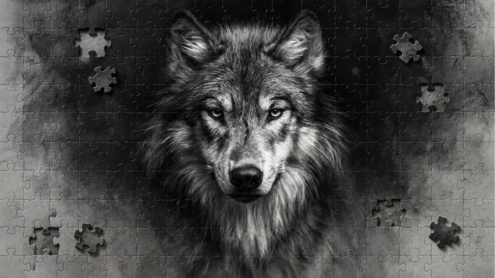
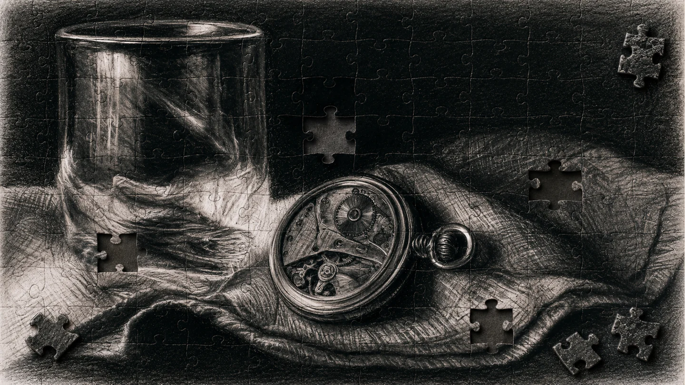
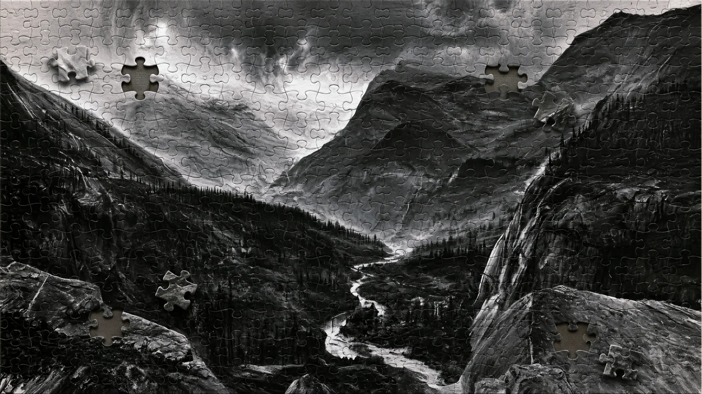
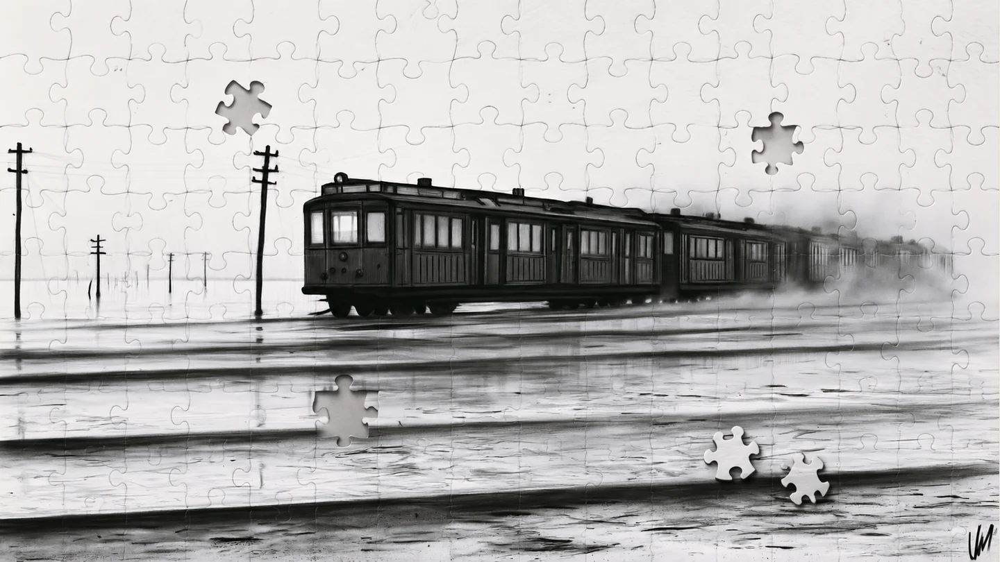

# Black Dust / 墨尘

<p align="center">
  
</p>

<p align="center">
  <strong>细腻木炭原画 × 真实全幅拼图 × 可校对社媒排版</strong><br>
  <em>Refined charcoal art × physical full-surface jigsaws × reliable social typography</em>
</p>

<p align="center">
  <a href="#中文">中文</a> · <a href="#english">English</a> · <a href="#新手安装推荐交给-codex">安装 / Install</a> · <a href="docs/GALLERY.md">完整图库 / Full gallery</a>
</p>

---

## 中文

### 项目简介

Black Dust（墨尘）是一套面向 Codex 的视觉生成 Skill。它把人物、动物、静物/产品、风景、建筑、机械、文字和文章主题转化为统一但不模板化的木炭视觉，并在需要时加入覆盖整幅画面的真实拼图切割。

它重点解决三个常见问题：木炭画不能只是照片加噪点；拼图不能只是平面线稿；缺失块必须在形状、原图内容、颜色和光线上一一对应。

| 能力 | 结果 |
|---|---|
| 细腻木炭原画 | 随形排线、侧锋铺调、擦揉中间调、选择性提亮和自然纸齿 |
| 真实全幅拼图 | 共享边刀模、标准圆头宽颈、方向性压切缝和纸板厚度 |
| 精确缺块配对 | 洞口与散件使用同一 mask 和同源像素，附拼回证明与独立审计 |
| 社媒与文章封面 | 主题驱动构图、可校对中英文、克制橙色重点和自然木炭划线 |
| 快速可恢复流程 | 底图、排字、拼图分阶段缓存；改字或调缺块不重新生成底图 |

### 已批准的品牌标准

<table>
  <tr>
    <td width="38%" align="center"><br><strong>3:4 Skill 封面</strong></td>
    <td width="62%" align="center"><br><strong>5:2 社媒品牌封面 / Social Cover</strong></td>
  </tr>
</table>

这两张图锁定品牌字组“墨尘 / SKILL / 把灵感，拼成画面”、实体炭棒的材料形态、暖象牙纸板、三组负空间配对和单一橙色重点。后续主题图可以改变主体，但不能牺牲木炭绘制逻辑、完整拼面和精确配对。

## 案例画廊 / Visual Gallery

八类精选案例以统一 16:9 画布展示，保留原图比例。点击图片即可查看对应类别的完整展示板，36 张历史案例全部收录在 [完整图库](docs/GALLERY.md)。

Eight featured studies share a 16:9 presentation canvas without stretching or cropping. Click a preview to explore its category; the [full gallery](docs/GALLERY.md) displays all 36 historical studies. These studies document the visual development; current Skill rules and approved covers define the delivery standard.

| | |
|---|---|
| [](docs/GALLERY.md#portrait)<br>**01 人物 / Portrait**<br><sub>五官与灰面 · Facial planes</sub> | [](docs/GALLERY.md#animal)<br>**02 动物 / Animal**<br><sub>毛流与目光 · Fur and gaze</sub> |
| [](docs/GALLERY.md#still-life)<br>**03 静物·产品 / Still Life · Product**<br><sub>光泽与材质 · Light and material</sub> | [](docs/GALLERY.md#landscape)<br>**04 风景 / Landscape**<br><sub>空间与层次 · Depth and atmosphere</sub> |
| [](docs/GALLERY.md#architecture)<br>**05 建筑 / Architecture**<br><sub>结构与雾层 · Structure and mist</sub> | [](docs/GALLERY.md#mechanical)<br>**06 机械·交通 / Mechanical · Transit**<br><sub>硬表面与动势 · Form and motion</sub> |
| [](docs/GALLERY.md#typography)<br>**07 中英文文字 / Chinese · English Type**<br><sub>字形与炭压 · Type and charcoal</sub> | [](docs/GALLERY.md#social-cover)<br>**08 社媒封面 / Social Cover**<br><sub>主题与构图 · Story and composition</sub> |

最新文章主题验证 / Latest article cover：

[](docs/gallery/09-latest-cover.webp)

完整的 36 张原始研究图索引、每类观察重点和使用边界见 [视觉研究图库 / Visual Study Gallery](docs/GALLERY.md)。

### 新手安装：推荐交给 Codex

打开 Codex 的一个本地任务，把下面整段复制到对话框并发送，Codex 会下载项目、安装依赖并完成检查：

```text
请从 https://github.com/xiaomiaode001/black-dust-skill 安装 Black Dust / 墨尘 Skill。
先把仓库下载到当前工作区中一个新的 black-dust-skill 子目录；如果目录已存在，检查它的来源和修改情况，不要覆盖现有内容，必要时使用新的目录。
检查 Python 3.10 或以上版本是否可用，选择本机可用的 python、python3 或 py -3；如未安装，告诉我最短的安装步骤。
进入下载后的仓库根目录，使用同一个 Python 解释器安装 black-dust/requirements.txt，然后运行 tools/install_skill.py。
如果已安装此 Skill，使用 --update，先自动备份旧版本再升级。
验证安装目录内有 SKILL.md、agents、assets、references、scripts、LICENSE、LICENSING.md 和 ASSET_LICENSE.md。
完成后告诉我安装路径、验证结果和如何开始使用。不要生成测试图片。
```

实际生成图片需要 Codex 会话中可用的图像生成/编辑工具；Python 脚本负责排版和拼图合成。安装不会购买图像服务，也不会自动配置第三方 API。

#### 已下载 ZIP 时

1. 在 GitHub 页面点击 **Code → Download ZIP**，解压项目。
2. 在 Codex 中打开解压后的项目根目录；根目录里应能看到 `README.md` 和 `black-dust/`。
3. 把下面整段复制给 Codex：

```text
请安装当前工作区中的 Black Dust / 墨尘 Skill。
请先确认项目中存在 black-dust/SKILL.md，然后完成以下操作：
1. 安装 black-dust/requirements.txt 中的 Python 依赖；
2. 运行 python tools/install_skill.py；
3. 如果已经安装过 black-dust，不要直接覆盖。先告诉我现有版本位置，再使用 --update，让安装器自动备份旧版本；
4. 确认安装目录中包含 SKILL.md、agents、assets、references 和 scripts；
5. 完成后告诉我安装路径、是否需要重启 Codex，以及验证结果。
```

安装器不会静默覆盖已有版本。首次安装成功后，重新打开 Codex 会话即可使用 `$black-dust`。

### 手动安装：复制两条命令

需要 Python 3.10+。可先下载 [项目 ZIP](https://github.com/xiaomiaode001/black-dust-skill/archive/refs/heads/main.zip) 并解压，或运行 `git clone https://github.com/xiaomiaode001/black-dust-skill.git`，然后在项目根目录运行：

```bash
python -m pip install -r black-dust/requirements.txt
python tools/install_skill.py
```

若系统提示找不到 `python`，macOS/Linux 可将两处 `python` 替换为 `python3`，Windows 可替换为 `py -3`。安装后在 Codex 新建会话；若未识别 `$black-dust`，重启 Codex。

更新已有安装时运行：

```bash
python tools/install_skill.py --update
```

`--update` 会先把旧版本保存到 Codex Skills 目录下的 `.black-dust-backups/`，再安装新版本。安装包不会复制测试、过程稿或本地输出。

### 第一次使用

安装后重新打开 Codex，并复制：

```text
使用 $black-dust 生成一张 5:2 社媒封面。
标题：我们以为 AI 只用了三年，其实它准备了十多年
由你规划主题图案和页面布局。保留细腻木炭绘制感，重点词可以使用一个橙色锚点和一条自然木炭划线；采用 3 组精确同源拼图缺块，全部避开标题和完整主体。只展示最终成图，速度优先。
```

更多常用请求：

```text
使用 $black-dust 把这张参考图转换成细腻木炭原画。保留人物身份、姿态和构图，边缘保留自然干笔与失边，不要墨点装饰，这次不需要拼图。
```

```text
使用 $black-dust 把整幅图做成真实标准拼图。拼缝覆盖完整画面，保留原木炭细节；3 个缺口与 3 个散件必须在形状和原图内容上一一对应，避开主体，并提供拼回审计结论。
```

### 建议提供的信息

| 输入 | 示例 | 默认行为 |
|---|---|---|
| 主题或参考图 | 人物照片、产品图、文章标题 | 没有参考图时根据主题规划主体 |
| 输出类型 | 原画、拼图、社媒封面 | “生成/优化”默认交付实际图像 |
| 尺寸或平台 | 5:2、微信公众号、小红书 | 未指定时按内容和平台推断 |
| 媒介 | 木炭绘画、实体炭棒 | 默认 `charcoal_drawing` |
| 拼图 | 无、完整拼面、3 组缺块 | 社媒封面默认 3 组且避开主体 |
| 速度 | `instant`、`rapid`、`balanced`、`quality` | 一般任务 `balanced`；社媒默认 `rapid` |

### 速度与质量

新主题最耗时的是图像模型。本项目只让模型生成一次连续底图，之后用本地确定性工具处理排字、拼图和审计：

| 档位 | 模型调用策略 | 适用场景 |
|---|---|---|
| `instant` | 0 次；仅复用明确指定或创作键完全一致的已批准底图 | 同系列封面、只改字或版式 |
| `rapid` | 新主题最多 1 次；失败不静默重试 | 默认社媒封面、快速测试 |
| `balanced` | 通常 1 次；硬门槛失败时允许一次定向修正 | 一般正式交付 |
| `explore` | 仅用户明确要求时生成多个方向 | 创意探索 |
| `quality` | 仅高分辨率或印刷级任务启用 | 高精度成品 |

当前本机回归中，1980×792 三缺块拼图合成中位耗时由 3.1462 秒降至 2.7395 秒，约快 12.9%。完整本地“排字＋拼图＋首次配对审计”约 3.3832 秒；相同请求缓存重跑约 0.0254 秒。数据随设备变化，不是性能承诺，也不包含外部图像模型延迟。

### 输出、隐私与公开展示

- 默认只向用户展示最终图片；普通过程稿和被替代版本不会进入公开画廊。
- 精确拼图会保留 manifest、原始裁片、拼回图和审计结果。
- `output/`、`validation/`、缓存和临时文件已被 Git 忽略。
- 不要提交含隐私、未获授权或受限版权的输入图片。

### 许可证与商用

Skill 规则、提示词、脚本和说明文档使用 [MIT 许可证](LICENSE)：允许免费使用、修改、商用、销售和再分发，分发时保留版权及许可证声明。

随包案例图片、封面与展示板使用 [CC BY 4.0](black-dust/ASSET_LICENSE.md)：允许分享、修改和商用，须署名、链接授权并注明修改。品牌名称可以用于介绍项目，不代表官方合作或背书。

仅使用 Skill 生成的独立新图片不会自动继承图库许可，也不要求每张新图为 Skill 署名；直接复用图库素材的部分仍按其授权使用。完整范围、品牌说明和生成结果的授权边界见 [中英双语授权说明](black-dust/LICENSING.md)。安装包会保留全部授权文件。

---

## English

### Overview

Black Dust is a Codex skill for producing refined charcoal artwork, physically readable full-surface jigsaws, and editorial social covers. It supports portraits, animals, still life and products, landscapes, architecture, machinery, typography, and article-led cover design without forcing every subject into the same dust or crack template.

Its central invariant is exact pairing: every removed piece shares the hole's geometry and original source pixels. Typography is composed before cutting, protected from missing pieces, and checked at the actual delivery ratio.

| Capability | What you get |
|---|---|
| Refined charcoal drawing | Form-following strokes, broad-side tone, smudged mid-values, selective lifting and natural paper tooth |
| Physical jigsaw surface | Shared-edge die geometry, readable rounded tabs, pressed seams and material-aware board depth |
| Exact missing-piece pairs | Same-mask holes and pieces, unchanged source content, assembled proof and independent audit |
| Social and article covers | Theme-led composition, verifiable Chinese/English type, one restrained orange accent and charcoal underline |
| Recoverable fast path | Cached base, typography and puzzle stages; text or piece changes do not regenerate approved artwork |

The eight category boards are displayed in the shared [Visual Gallery](#案例画廊--visual-gallery). The full 36-image study inventory is documented in [docs/GALLERY.md](docs/GALLERY.md).

### Beginner installation: let Codex do it

Open a local task in Codex and paste this entire prompt. Codex will download the project, install dependencies and verify the installed files:

```text
Install Black Dust from https://github.com/xiaomiaode001/black-dust-skill.
Download the repository into a new black-dust-skill subdirectory of the current workspace. If that directory exists, check its origin and local changes; preserve existing content and use a new directory if necessary.
Check for Python 3.10 or newer using whichever of python, python3 or py -3 is available. If Python is missing, give me the shortest setup instructions.
From the downloaded repository root, use the same Python interpreter to install black-dust/requirements.txt, then run tools/install_skill.py.
If the skill is already installed, use --update to back up the old copy before upgrading.
Verify SKILL.md, agents, assets, references, scripts, LICENSE, LICENSING.md and ASSET_LICENSE.md in the installed directory.
Report the installation path, verification result and first-use instructions. Do not generate a test image.
```

Image generation requires an image-generation/editing tool available in your Codex session. The Python scripts handle typography and jigsaw compositing. Installation does not purchase image services or configure third-party APIs.

#### If you already downloaded the ZIP

1. On GitHub, choose **Code → Download ZIP**, then extract the project.
2. Open the extracted project root in Codex. You should see `README.md` and the `black-dust/` folder.
3. Paste this into Codex:

```text
Install the Black Dust skill from the current workspace.
First confirm that black-dust/SKILL.md exists, then:
1. install the Python dependencies from black-dust/requirements.txt;
2. run python tools/install_skill.py;
3. if black-dust is already installed, do not overwrite it silently. Tell me where it is, then use --update so the installer backs up the old copy;
4. verify that the installed folder contains SKILL.md, agents, assets, references, and scripts;
5. report the final install path, whether Codex needs to restart, and the validation result.
```

The installer stops when an existing copy is found. It only replaces that copy when `--update` is explicitly used, and it keeps a backup.

### Manual installation

Python 3.10+ is required. Download and extract the [project ZIP](https://github.com/xiaomiaode001/black-dust-skill/archive/refs/heads/main.zip), or run `git clone https://github.com/xiaomiaode001/black-dust-skill.git`. Then run these commands from the repository root:

```bash
python -m pip install -r black-dust/requirements.txt
python tools/install_skill.py
```

To update an existing installation:

```bash
python tools/install_skill.py --update
```

If `python` is not found, replace it in both commands with `python3` on macOS/Linux or `py -3` on Windows. Start a new Codex session after installation, then invoke `$black-dust`; restart Codex if the skill is not detected.

### First prompt

```text
Use $black-dust to create a 5:2 social cover.
Title: We thought AI took only three years, but it had been preparing for more than a decade.
Plan the subject and layout. Preserve refined charcoal drawing, use at most one orange semantic accent and one natural charcoal underline, and add exactly three source-matched missing-piece pairs outside the title and complete subject. Show only the final image and prioritize speed.
```

Other useful prompts:

```text
Use $black-dust to transform this reference into refined charcoal artwork. Preserve identity, pose, and composition; retain natural dry-brush and lost edges; avoid decorative ink specks. No jigsaw treatment is needed.
```

```text
Use $black-dust to turn the entire image into a physical jigsaw surface. Keep the original charcoal detail. Add three missing holes and three loose pieces that match one-to-one in shape and source content, keep them away from the subject, and report the assembled-pair audit.
```

### Speed profiles

| Profile | Model-call policy | Best for |
|---|---|---|
| `instant` | Zero calls; exact reuse of an explicitly selected or signature-identical approved base | Series covers and typography-only updates |
| `rapid` | At most one call for a new theme; no silent retry | Default social covers and quick tests |
| `balanced` | Normally one call; one targeted correction only after a hard failure | General production work |
| `explore` | Multiple directions only when explicitly requested | Creative exploration |
| `quality` | Reserved for high-resolution or print work | High-detail delivery |

On the current test machine, the median 1980×792 three-hole puzzle composite improved from 3.1462 s to 2.7395 s, a 12.9% reduction. A clean local typography, puzzle, and first audit run took 3.3832 s; an identical cached rerun took 0.0254 s. These are machine-specific measurements, not guarantees, and exclude external image-model latency.

### Output and privacy

- Only selected final images are public by default; abandoned drafts stay out of the gallery.
- Exact puzzle delivery retains the manifest, raw pieces, assembled proof, and audit result.
- Generated outputs, caches, validation data, and temporary assets are ignored by Git.
- Do not publish private, unlicensed, or restricted reference images.

### License and commercial use

Skill rules, prompts, scripts and documentation use the [MIT License](LICENSE). Use, modification, commercial use, sale and redistribution are permitted; retain the copyright and license notices when distributing the software.

Bundled images, covers and gallery boards use [CC BY 4.0](black-dust/ASSET_LICENSE.md). Sharing, adaptation and commercial use are permitted with attribution, a license link and an indication of changes. The brand may be used to identify the project; this does not imply official affiliation or endorsement.

Independent new images do not inherit the gallery license merely because the skill generated them, and no per-image skill credit is required. Portions that reuse bundled artwork retain its license obligations. See the [bilingual licensing guide](black-dust/LICENSING.md) for content scopes, brand use and output terms. Installed copies retain all license files.

---

## Project structure / 项目结构

```text
black-dust-skill/
├─ LICENSE                        # MIT for software and documentation
├─ black-dust/
│  ├─ SKILL.md                     # Skill entry and decision rules
│  ├─ LICENSE                      # MIT retained in installed copies
│  ├─ LICENSING.md                 # Content scopes, brand and output terms
│  ├─ ASSET_LICENSE.md             # CC BY 4.0 for bundled imagery
│  ├─ agents/openai.yaml           # Codex metadata and invocation policy
│  ├─ assets/                      # Approved 3:4 and 5:2 visual standards
│  ├─ references/                  # Charcoal, puzzle, type, platform and QA rules
│  ├─ scripts/                     # Typography, jigsaw, audit and cached rendering
│  └─ tests/                       # Geometry, material, pairing and cache regression
├─ docs/gallery/                   # Lightweight GitHub gallery boards
├─ examples/                       # Reusable UTF-8 request examples
├─ tools/install_skill.py          # Beginner-safe cross-platform installer
├─ tools/check_release.py          # Public-tree release audit
├─ tools/benchmark_render.py       # Local deterministic benchmark
└─ output/                         # Local generated files; ignored by Git
```

## Development and release checks / 开发与发布检查

```bash
python -m unittest discover -s black-dust/tests -v
python -X utf8 ~/.codex/skills/.system/skill-creator/scripts/quick_validate.py ./black-dust
python tools/check_release.py
python tools/benchmark_render.py output/2026-09-11/ai-decade-twitter-cover/v02/render.request.json
```

Windows PowerShell can use the same Python commands; if the validator is installed under the current Windows user profile, use:

```powershell
python -X utf8 "$env:USERPROFILE\.codex\skills\.system\skill-creator\scripts\quick_validate.py" ".\black-dust"
```

GitHub Actions runs the regression suite, release-tree audit, and beginner-installer smoke test on every push and pull request. Exact-pair structure is programmatically verified; final aesthetics also receive visual review.
