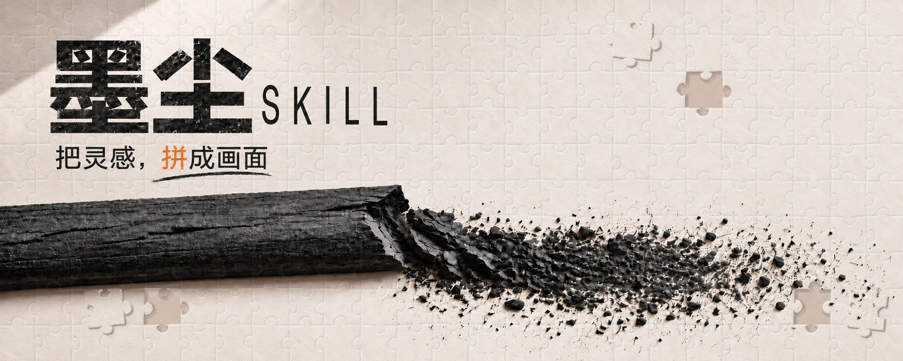

# Black Dust / 墨尘：创作缘起与制作方法

  

  <strong>从木炭留下的痕迹，到一张能够真正拼回去的画面</strong> 
  <em>From the trace of charcoal to an image that can actually be reassembled</em>

## 中文

### 灵感从哪里来

“墨尘”最初不是一套滤镜，而是一个材料叙事：一根干燥的木炭在纸面断裂，断口露出片层和纤维，碎屑由大到小过渡为颗粒与粉尘。黑色物质在暖色纸面留下方向、压力和时间的痕迹。

拼图加入后，这个画面获得了第二层含义。灵感往往以碎片出现，创作则是在限制、选择和修订中让碎片形成关系。项目因此使用“把灵感，拼成画面”作为核心句子。拼图不是附着在图像上的图标；整幅画面本身就是同一张被印刷、压切、取出并能够重新拼回的纸板。

### Midjourney 8.2 在项目中的角色

根据本项目的创作记录，仓库展示的视觉研究和连续画面底稿在探索阶段使用 **Midjourney 8.2** 生成或辅助生成。它主要承担：

- 将主题、主体、光线、留白和木炭媒介描述转化为连续画面底稿；
- 快速探索人物、动物、静物/产品、风景、建筑、机械、文字与社媒封面八类构图；
- 为纸齿、擦揉、侧锋铺调、选择性提亮和实体炭棒等视觉方向提供比较材料。

这些图片不是“全程手工绘制”的声明，也不是由 Midjourney 直接完成的精确拼图证明。模型生成的文字、拼缝、缺口和散件无法稳定保证字面正确或像素级对应，因此项目把这些部分移到确定性流程中完成。

项目级披露记录了使用的模型版本与用途。仓库没有为每张历史研究图保存完整的 Midjourney prompt、seed 或 job ID，因此不对缺失的单图参数作推测。

### 人、Skill 与工具如何分工

| 环节 | 负责内容 | 可验证结果 |
|---|---|---|
| 创作者 / 艺术指导 | 提出主题，选择参考角色，筛选底稿，判断木炭、主体、构图和品牌气质 | 批准封面、分类图库、视觉规则 |
| Midjourney 8.2 | 生成或辅助生成无拼缝的连续画面底稿与视觉探索 | 候选底图、历史研究图 |
| Black Dust Skill | 把审美标准转成可重复执行的决策规则，规划主题、文字、保护区与缺块分布 | Skill 指令、请求参数、QA 清单 |
| 本地确定性脚本 | 排版中英文，生成共享边拼图，切出同源缺块，制作拼回图并审计 | 最终 PNG、manifest、原始裁片、assembled proof、audit |

“创作”在这里是一条组合链：概念、选择、取舍和审美判断来自人；Midjourney 8.2 提供画面探索能力；Skill 保存方法；脚本负责模型不适合保证的几何与文字准确性。

### 从主题到最终画面

1. **主题与保护项**：确定主体、叙事重点、平台比例和不能被缺块破坏的区域。
2. **连续底稿**：使用 Midjourney 8.2 生成或转换一张没有拼缝、洞口、散件和生成文字的连续木炭画面。
3. **人工筛选**：检查结构、身份、材质、灰阶、纸面、失边和留白；不合格底稿不会因为“风格像”就进入成品。
4. **确定性文字**：中文和英文以可校对字体骨架排版，再加入从纸面采样的炭压、纸齿与自然划线。
5. **真实拼图**：整幅图使用一套共享边刀模切割。拼缝具有压切暗槽、方向性纸边肩部与随尺寸变化的纸板厚度。
6. **同源缺块**：默认三组缺口与散件避开主体和标题。每一块使用缺口位置的原始像素和同一 mask，只允许旋转与物理摆放。
7. **拼回审计**：保存无缺口拼回图，对 mask、内容和成品文件记录哈希，再进行全图、局部与缩略图检查。

    主题与参考
        ↓
    Midjourney 8.2 连续画面底稿
        ↓
    人工审美筛选与定稿
        ↓
    确定性中英文排版
        ↓
    全幅共享边拼图 + 同源缺块
        ↓
    拼回证明、哈希审计与视觉检查

### 图库应该怎样阅读

仓库中的 [36 张视觉研究](../docs/GALLERY.md) 覆盖八个完整类别。它们记录了 Skill 从平面拼缝、形状不自然、主体不够像拼图、缺块内容不对应等问题，逐步走向真实纸板、清楚圆头宽颈、完整拼面和精确配对的过程。

图库中的早期图片是研究资料，不等于当前质量承诺。当前成品以 [3:4 Skill 封面](assets/skill-cover.png)、[5:2 社媒品牌封面](assets/social-cover-5x2.png)、现行 [Skill 规则](SKILL.md) 和自动测试为准。

### 名称与关系说明

Midjourney 是第三方产品名称。Black Dust / 墨尘是独立项目，不表示与 Midjourney 存在官方合作、认可或背书。随仓库发布的图片适用 [图片授权](ASSET_LICENSE.md)，该授权只覆盖贡献者有权许可的权利；使用第三方生成服务时仍应遵守相应服务条款。

---

## English

### Where the idea came from

Black Dust began as a material story rather than a filter: a dry charcoal stick breaks across warm paper, exposing layered fibers as fragments diminish into granules and powder. The black material records direction, pressure and time.

The jigsaw adds a second meaning. Ideas often arrive as fragments; creative work gives those fragments a relationship through constraints, selection and revision. This led to the line **“Turn inspiration into a complete picture.”** The jigsaw is not an icon placed over an image. The entire picture is treated as one printed, die-cut board whose pieces can be removed and assembled again.

### The role of Midjourney 8.2

According to the project's production record, the visual studies and continuous image bases displayed in this repository were generated or developed with **Midjourney 8.2** during exploration. Its main roles were:

- translating themes, subjects, light, negative space and charcoal-medium descriptions into continuous image bases;
- rapidly exploring composition across eight categories: portraits, animals, still life and products, landscapes, architecture, machinery, typography and social covers;
- providing material for comparing paper tooth, rubbed values, broad-side tone, selective lifting and physical charcoal-stick forms.

These images are not presented as entirely hand-drawn works, and Midjourney output is not treated as proof of exact puzzle pairing. Generated lettering, seams, holes and loose pieces cannot reliably guarantee correct text or pixel-level correspondence, so the project handles those stages deterministically.

The repository discloses the model version and its project-level role. Complete Midjourney prompts, seeds and job IDs were not retained for every historical study, so missing per-image parameters are not reconstructed or claimed.

### Roles in the finished work

| Stage | Responsibility | Verifiable result |
|---|---|---|
| Creator / art direction | Define themes, assign reference roles, select image bases, and judge charcoal, subject, composition and brand character | Approved covers, categorized gallery and visual rules |
| Midjourney 8.2 | Generate or assist continuous image bases and visual exploration | Candidate bases and historical studies |
| Black Dust Skill | Turn the visual standard into reusable decisions for theme, typography, protected regions and piece placement | Skill instructions, request parameters and QA criteria |
| Local deterministic tools | Compose Chinese and English text, build shared-edge geometry, extract source-matched pieces, assemble proofs and audit files | Final PNG, manifest, raw pieces, assembled proof and audit |

Creation here is a combined process: the human supplies the concept, selection, restraint and aesthetic judgment; Midjourney 8.2 supplies visual exploration; the Skill preserves the method; scripts enforce the geometry and text accuracy that a generative model cannot guarantee.

### From theme to final image

1. **Theme and protected content:** define the subject, narrative emphasis, delivery ratio and regions that missing pieces must avoid.
2. **Continuous image base:** use Midjourney 8.2 to generate or transform a charcoal image without seams, holes, loose pieces or generated lettering.
3. **Human selection:** review structure, identity, materials, values, paper, lost edges and negative space before approving the base.
4. **Deterministic typography:** compose verifiable Chinese and English glyphs, then add paper-sampled charcoal pressure, tooth and one natural underline.
5. **Physical jigsaw:** cut the whole image with one shared-edge die system, including a pressed groove, directional shoulders and scale-aware board depth.
6. **Source-matched pieces:** place three hole-piece pairs outside the subject and title by default. Each piece uses the hole's original pixels and exact mask, with rotation and physical placement only.
7. **Assembly audit:** save the complete assembled proof, record hashes for masks, content and files, and inspect the full image, local detail and final thumbnail.

### How to read the gallery

The [36-image visual study](../docs/GALLERY.md) covers all eight categories. It records the progression from flat seams, awkward shapes, weak full-surface readability and mismatched pieces toward physical board depth, clear rounded tabs, complete jigsaw surfaces and exact source pairing.

Earlier images are research artifacts rather than the current quality promise. Current delivery is defined by the [3:4 Skill cover](assets/skill-cover.png), [5:2 social brand cover](assets/social-cover-5x2.png), current [Skill rules](SKILL.md) and automated checks.

### Names and relationship

Midjourney is the name of a third-party product. Black Dust is an independent project and does not imply affiliation with, endorsement by or approval from Midjourney. Bundled images use the [image and gallery license](ASSET_LICENSE.md), limited to rights the contributors are entitled to license; use of third-party generation services remains subject to their applicable terms.
