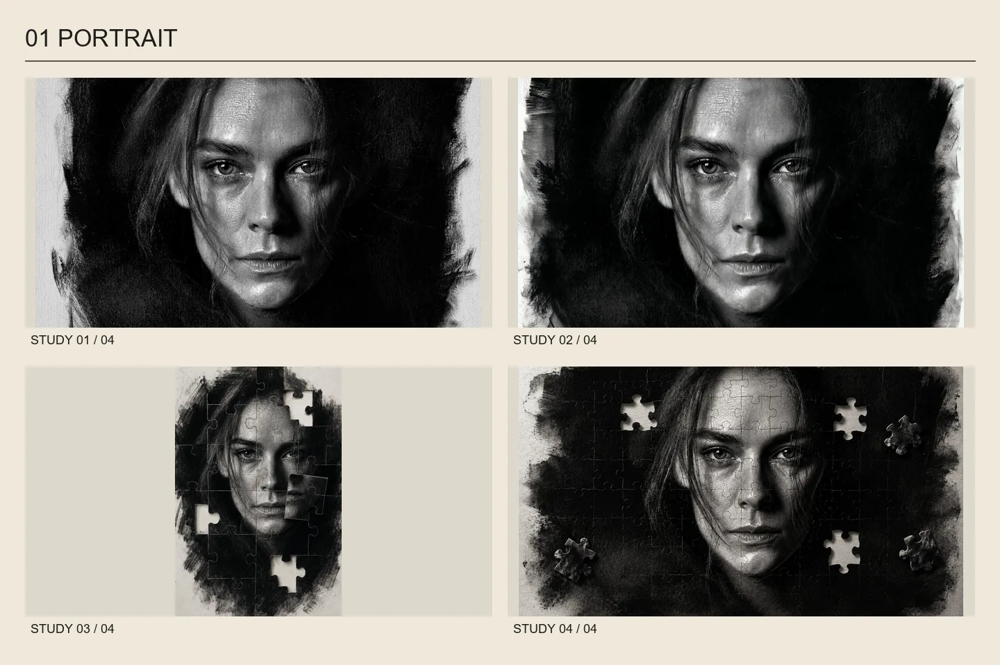
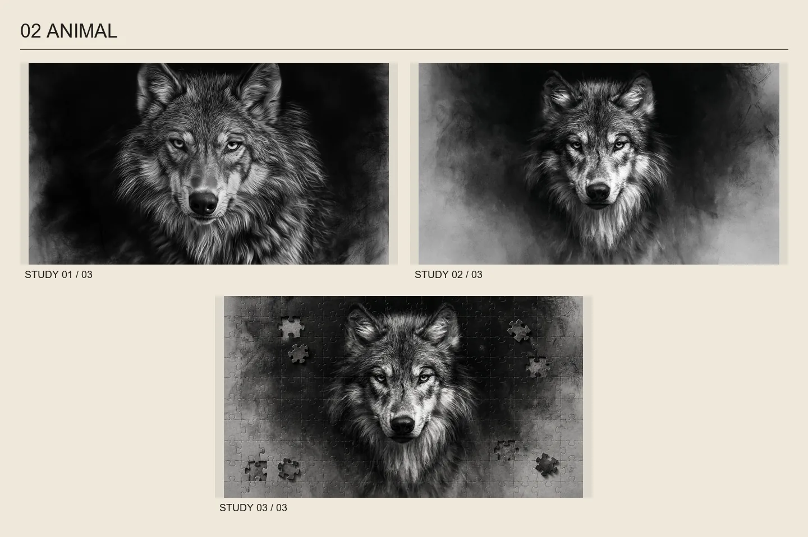
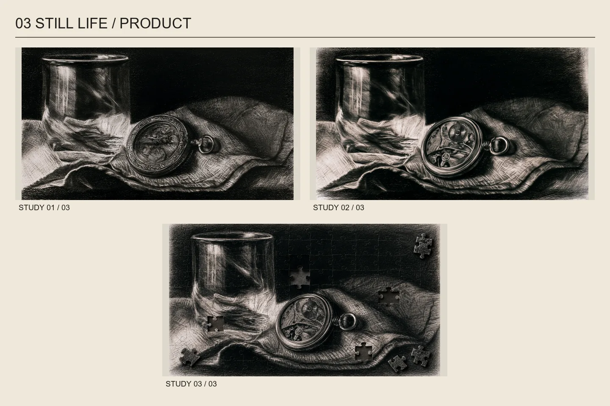
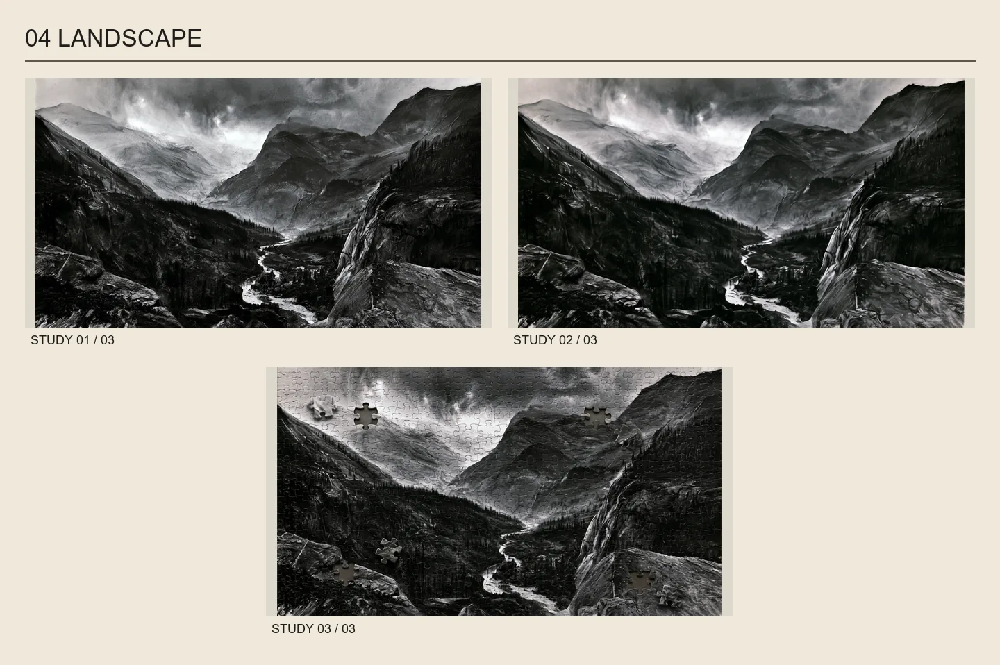
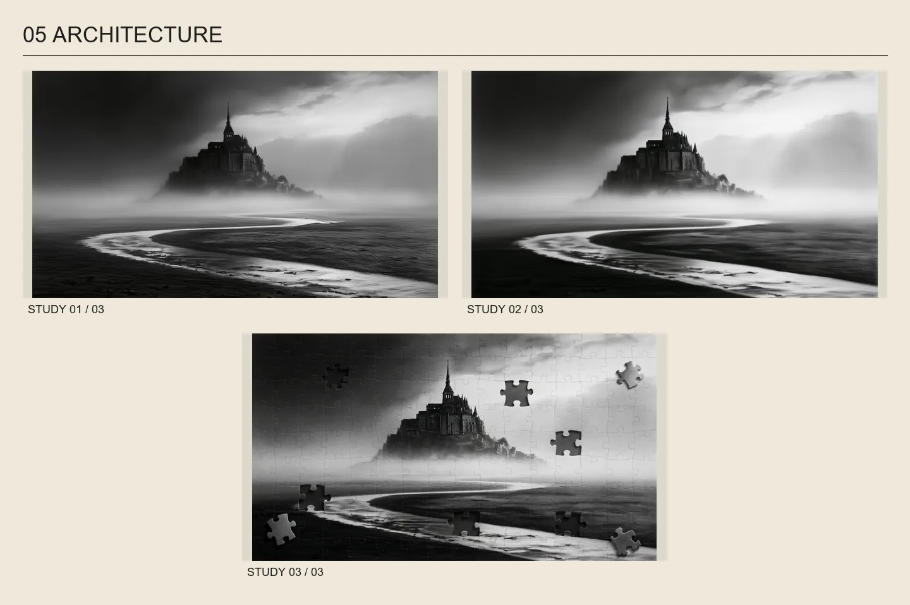
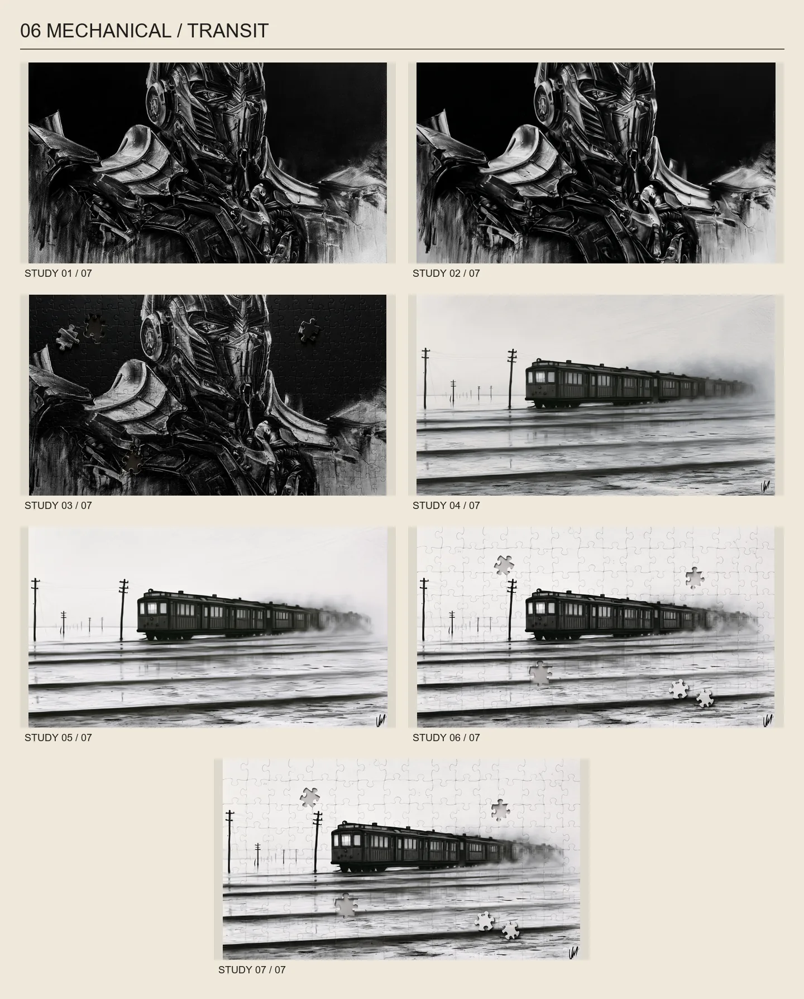
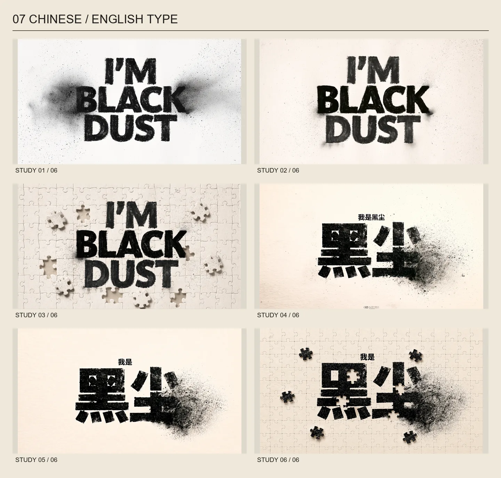
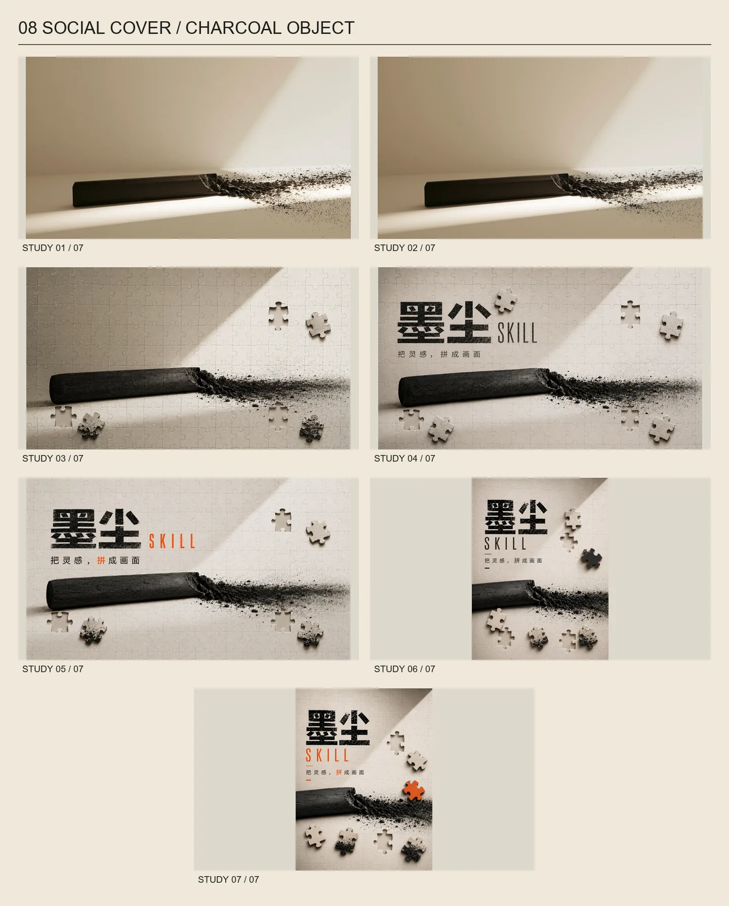
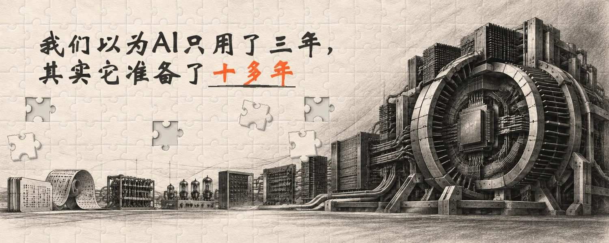

# Black Dust 视觉研究图库 / Visual Study Gallery

本页记录 README 中八张展示板包含的 36 张历史图片。所有展示板只做等比例缩放与统一排版，不把历史缺陷重新定义成 Skill 规则。

This page inventories the 36 historical images contained in the eight README boards. The boards use proportional resizing and a consistent editorial layout; earlier experiments do not override the current Skill rules.

图库图片、展示板及板内案例使用 [CC BY 4.0](../black-dust/ASSET_LICENSE.md)，署名为 **Black Dust / 墨尘 contributors**。转载或改编时请链接原图或项目、链接许可证并注明修改；具体署名方法见授权文件。

Gallery images, boards and their constituent studies use [CC BY 4.0](../black-dust/ASSET_LICENSE.md), credited to **Black Dust / 墨尘 contributors**. When sharing or adapting, link the source and license and identify changes; the license notice includes attribution guidance.

## 01 人物 / Portrait

`1.png`、`2.png`、`3.png`、`3（2）.png`

关注身份与五官保真、皮肤连续灰面、头发边缘和标准拼块轮廓。

Focus: identity and facial fidelity, continuous skin values, hair edges, and readable standard piece geometry.

## 02 动物 / Animal

`4.png`、`4（2）.png`、`4（3）.png`

关注毛流方向、眼睛焦点、胸毛的宽窄笔触与完整主体保护。

Focus: fur direction, eye focus, varied chest-fur strokes, and protection of the complete subject.

## 03 静物 / 产品 · Still Life / Product

`5.png`、`5（2）.png`、`5（3）.png`

关注玻璃、金属与布料的材质区分，避免刻意涂抹和统一假纹理。

Focus: material separation across glass, metal, and fabric without generic smudging or one repeated texture.

## 04 风景 / Landscape

`6.png`、`6（2）.png`、`6（21）.png`

关注近景宽面、树林暗群、远山空气感和河道引导线。

Focus: broad foreground planes, grouped forest darks, atmospheric mountains, and the river as a leading line.

## 05 建筑 / Architecture

`6（3）.png`、`6（4）.png`、`6（5）.png`

关注塔身轮廓、雾化层次与散件内容和原缺口的同源匹配。

Focus: architectural silhouette, mist hierarchy, and source-matched content between each loose piece and its hole.

## 06 机械 / 交通 · Mechanical / Transit

`7.png`、`7（2）.png`、`7（3）.png`、`8.png`、`8（2）.png`、`8（3）.png`、`8（4）.png`

关注机械结构缝、受控高光、横向动势和低对比雾景中的拼缝可识别度。

Focus: mechanical structure, controlled highlights, horizontal motion, and seam readability in low-contrast mist.

## 07 中英文文字 / Chinese and English Type

`9.png`、`9（2）.png`、`9（3）.png`、`10.png`、`10（1）.png`、`10（2）.png`

关注中文字形、英文字距、炭压变化和文字在完整拼面上的可读性。

Focus: correct Chinese glyphs, English spacing, charcoal pressure, and legibility across the complete jigsaw surface.

## 08 社媒封面 / 实物炭棒 · Social Cover / Charcoal Object

`11.png`、`11（2）.png`、`11（3）.png`、`11（5）.png`、`11(6).png`、`12.png`、`13.png`

关注主题层级、标题净空、炭棒断面、碎屑与细粉的物理来源，以及克制的橙色强调。

Focus: editorial hierarchy, title clearance, charcoal fracture, physically sourced debris, and restrained orange emphasis.

## Skill 封面 / Skill Covers

`black-dust/assets/skill-cover.png` 是当前 Skill 与项目介绍封面。保留“墨尘 / SKILL / 把灵感，拼成画面”的品牌层级、实物炭棒和暖灰纸板质感；副标题仅以橙色木炭强调“拼”，并用一条自然压力变化的木炭划线承接“拼成画面”。画面采用 3 组浅纸同源视觉配对，散件不再混入与洞口来源不一致的黑色粉尘图案。

`black-dust/assets/social-cover-5x2.png` 是同一标准的 5:2 横版：左上品牌字组、下半部炭棒主轴、向右展开的物理粉尘路径，以及避开文字和主体的 3 组非对称拼图节点。

`black-dust/assets/skill-cover.png` is the current vertical project cover. It preserves the “墨尘 / SKILL / 把灵感，拼成画面” hierarchy, compressed-charcoal object, warm board, one orange semantic accent, and one naturally pressured underline.

`black-dust/assets/social-cover-5x2.png` is the approved 5:2 counterpart: upper-left brand lockup, lower charcoal axis, rightward physical dust path, and three asymmetric source-matched pairs outside the text and subject.

## 最新验证成品 / Latest Validated Cover

`docs/gallery/09-latest-cover.webp` 来自 5:2 标题测试：`我们以为 AI 只用了三年，其实它准备了十多年`。它使用标准 v5 拼图几何、3 组同源缺口与散件，并通过配对审计。

`docs/gallery/09-latest-cover.webp` is the 5:2 article-cover test titled “We thought AI took only three years, but it had been preparing for more than a decade.” It uses standard-v5 geometry, three source-matched hole/piece pairs, and a passing pair audit.
